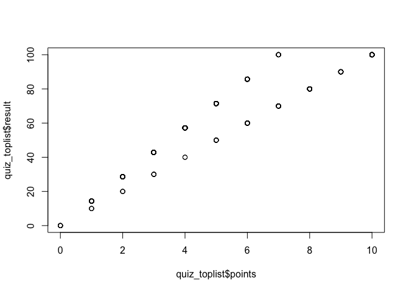
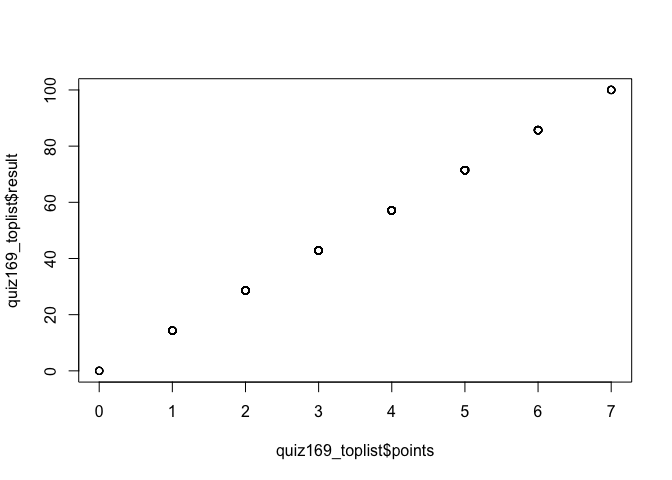
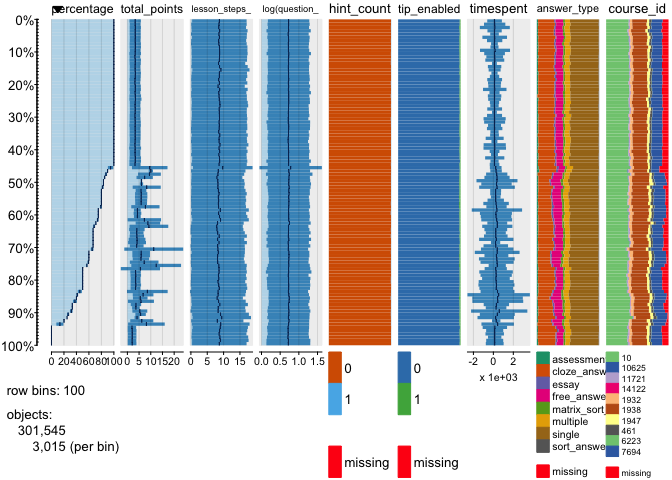
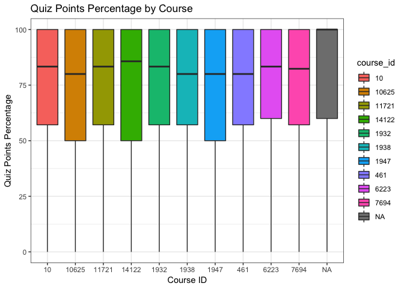
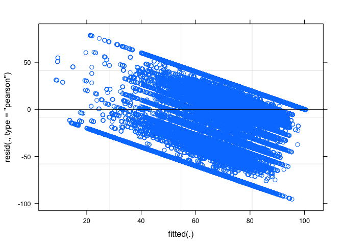
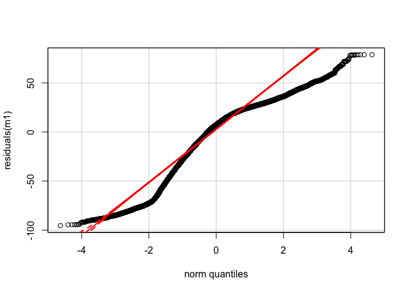

RCO Data Cleaning
================
Huafeng (Hua) Zhang
March 12 2018

Table of Contents
-----------------

-   [Load packages](#loadpackages)
-   [Connect to local database](#connecttolocaldatabase)
    -   [Get list of tables and columns in the database](#getlistoftablesandcolumnsinthedatabase)
-   [Read tables](#readtables)
-   [Exploratory analysis of each table](#exploratoryanalysisofeachtable)
    -   [users table](#userstable)
        -   [Findings](#findings)
        -   [Questions](#questions)
        -   [Hua's suggestions](#huassuggestions)
    -   [usermeta table](#usermetatable)
        -   [Findings](#findings)
        -   [Questions](#questions)
        -   [Hua's suggestions](#huassuggestions)
    -   [activity table](#activitytable)
        -   [Findings](#findings)
        -   [Questions](#questions)
        -   [Hua's suggestions](#huassuggestions)
    -   [activitymeta table](#activitymetatable)
        -   [Findings](#findings)
        -   [Questions](#questions)
    -   [posts table](#poststable)
        -   [Questions](#questions)
    -   [postmeta table](#postmetatable)
        -   [Questions](#questions)
    -   [quiz question table](#quizquestiontable)
        -   [Findings](#findings)
        -   [Questions](#questions)
    -   [quiz statistics table](#quizstatisticstable)
        -   [Questions](#questions)
    -   [Hua's suggestions](#huassuggestions)
    -   [quiz statistic ref table](#quizstatisticreftable)
        -   [Findings](#findings)
        -   [Questions](#questions)
        -   [Hua's suggestions](#huassuggestions)
-   [Join tables](#jointables)
-   [EDA](#eda)
-   [Build model](#buildmodel)
    -   [Validate assumptions](validateassumptions)
-   [Cross validation](#crossvalidation)

Load packages
-------------

``` r
set.seed(8888)

# Helper function to install a package if not installed and load.
use_package <- function(p){
  if (!is.element(p, installed.packages()[,1]))
    install.packages(p, dep = TRUE,
                     repos = c(CRAN = 'http://cran.us.r-project.org'))
  library(p, character.only = TRUE, quietly = TRUE, verbose = FALSE)
}
use_package("RMySQL")
use_package("tidyverse")
use_package("ggplot2")
use_package("mosaic")
use_package("classInt")
use_package("tabplot")
use_package("data.table")
use_package("knitr")
use_package("stringr")
use_package("anytime")
use_package("GGally")
use_package("lme4")
use_package("boot")
use_package("finalfit")
use_package("gridExtra")
use_package("reshape2")
use_package("grid")
use_package("groupdata2")
use_package("car")
use_package("effects")
```

Connect to local database
-------------------------

``` r
db <- dbConnect(RMySQL::MySQL(), host='localhost', port=3306, dbname = "rco_classroom",
                user = "Hua", password = "24")
dbSendQuery(db,'SET NAMES utf8') 
```

    ## <MySQLResult:268938984,0,0>

### Get list of tables and columns in the database

``` sql
select t.*,c.*,k.*
from information_schema.tables t
inner join information_schema.COLUMNS c
      on c.table_schema = t.table_schema
      and c.table_name = t.table_name
left outer join information_schema.key_column_usage k
      on k.table_schema = t.table_schema
      and k.table_name = t.table_name
      and k.column_name = c.column_name
      and k.referenced_column_name is not NULL
where t.table_schema = 'rco_classroom'
order by t.table_name;
```

Read tables
-----------

``` r
rdb = dbConnect(MySQL(), user = 'Hua', password = '24', dbname = 'rco_classroom', host = 'localhost', port = 3306)
{
  users <- dbGetQuery(rdb, "SELECT * FROM wpt1_users")
  usermeta <- dbGetQuery(rdb, "SELECT * FROM wpt1_usermeta")
  activity <- dbGetQuery(rdb, "SELECT * FROM wpt1_learndash_user_activity")
  activitymeta <- dbGetQuery(rdb, "SELECT * FROM wpt1_learndash_user_activity_meta")
  posts <- dbGetQuery(rdb, "SELECT ID, post_title, post_type, post_content FROM wpt1_posts")
  postmeta <- dbGetQuery(rdb, "SELECT * FROM wpt1_postmeta WHERE meta_key IN ('course_id', 'lesson_id', 'question_id' 'quiz_id', 'quiz_pro_id')")
  quiz_question <- dbGetQuery(rdb, "SELECT * FROM wpt1_wp_pro_quiz_question")
  quiz_statistic <- dbGetQuery(rdb, "SELECT * FROM wpt1_wp_pro_quiz_statistic")
  quiz_statistic_ref <- dbGetQuery(rdb, "SELECT * FROM wpt1_wp_pro_quiz_statistic_ref")
  quiz_toplist <- dbGetQuery(rdb, "SELECT * FROM wpt1_wp_pro_quiz_toplist") # why only for quiz 18 and quiz 169: quiz_id, date, user name, points,results
}
dbDisconnect(rdb)
```

    ## [1] TRUE

Exploratory analysis of each table
----------------------------------

-   Rename columns for each table (keep consistent)
-   Check data type
-   Check missing values
-   Check duplicated records
-   Check data content
-   Check which variables are of interest
-   Exploratory plots

### users table

``` r
names(users)
```

    ##  [1] "ID"                  "user_login"          "user_pass"          
    ##  [4] "user_nicename"       "user_email"          "user_url"           
    ##  [7] "user_registered"     "user_activation_key" "user_status"        
    ## [10] "display_name"

``` r
# check duplicated records: No duplicates when it returns TRUE 
length(unique(users$ID)) == length(users$ID) #TRUE
```

    ## [1] TRUE

``` r
# make column names of columns of interest consitent
setnames(users, old = c("ID", "user_registered"), new = c("user_id", "user_registered_at"))

# convert balnk cells to NA
users$user_url <- ifelse(nzchar(users$user_url), users$user_url, NA)

users$user_activation_key <- ifelse(nchar(users$user_activation_key) == 0, 
                                    NA,users$user_activation_key)

# get ratio of NAs
round(sum(is.na(users$user_url))/nrow(users), 3) # 79.1% of users' url are missing
```

    ## [1] 0.791

``` r
round(sum(is.na(users$user_activation_key))/nrow(users), 3) # 94.2% of users' activation key are missing
```

    ## [1] 0.942

``` r
# fix data type
users$user_registered_at <- as.Date(as.factor(users$user_registered_at), format = "%Y-%m-%d %H:%M:%S")

users <- users[,c(1,7)]
```

#### Findings

``` r
# summary statistics
paste("There are", nrow(users), "users registered in total at therefugeecenter.org from",
      range(users$user_registered_at)[1], "to", range(users$user_registered_at)[2], ".", sep = " ")
```

    ## [1] "There are 25444 users registered in total at therefugeecenter.org from 2015-03-31 to 2018-03-16 ."

``` r
users_date <- users %>%
              group_by(user_registered_at) %>%
              summarise(num_user = n()) %>%
              mutate(total_user = cumsum(num_user))

users_date$user_registered_at <- as.Date(as.factor(users_date$user_registered_at), format = "%Y-%m-%d")

p1 <- ggplot(users_date, aes(x = user_registered_at, y = total_user)) +
  geom_line() +
  xlab("Date") +
  ylab("Total Number of Users") +
  ggtitle("Total Number of RCO Users Registered Since 2015") +
  theme_bw()
p1
```


#### Questions

-   What does `user_status` mean? Why all of them are 0 in the users table?
-   Do we have users' role info? So we can check if a user is student or RCO staff, etc? (Yes, capability)

#### Hua's suggestions

-   Only keep `user_id` and `user_registered_at` in this table.

### usermeta table

#### Questions

-   Do you see any information from `meta_key` that we can use? (check t1 to see what are included in `meta_key`)
-   What is `course_completed_10625` (metavalue should be time, what is the format?), `wpt1_user_level` (only 4 levels: 0,1,7,10 and most of them are 0), `wpt1_capabilities`, `use_ssl` and `learndash-last-login` in `meta_key`?

``` r
usermeta$meta_key <- as.factor(usermeta$meta_key)
t1 <- as.data.frame(summary(usermeta$meta_key))
t1 <- setDT(t1, keep.rownames = TRUE)
knitr::kable(head(t1))
```

| rn                 |  summary(usermeta$meta\_key)|
|:-------------------|----------------------------:|
| admin\_color       |                        25444|
| comment\_shortcuts |                        25444|
| description        |                        25444|
| first\_name        |                        25444|
| last\_name         |                        25444|
| nickname           |                        25444|

``` r
wpt1_user_level <- subset(usermeta, usermeta$meta_key == "wpt1_user_level")
wpt1_user_level$meta_value <- as.factor(wpt1_user_level$meta_value)
summary(wpt1_user_level$meta_value)
```

    ##     0     1    10     7 
    ## 25420     2     8    14

``` r
colnames(wpt1_user_level)[4] <- "user_level"
# length(unique(wpt1_user_level$user_id))
users <- left_join(users, wpt1_user_level[,c(2,4)], by = "user_id")
```

``` r
wpt1_capabilities <- subset(usermeta, usermeta$meta_key == "wpt1_capabilities")
wpt1_capabilities$meta_value <- as.factor(wpt1_capabilities$meta_value)
summary(wpt1_capabilities$meta_value)
```

    ##                               a:1:{s:10:"subscriber";b:1;} 
    ##                                                       1411 
    ##                                    a:1:{s:6:"editor";b:1;} 
    ##                                                          6 
    ##      a:2:{s:10:"subscriber";b:1;s:13:"bbp_moderator";b:1;} 
    ##                                                          2 
    ##    a:2:{s:10:"subscriber";b:1;s:15:"bbp_participant";b:1;} 
    ##                                                      24003 
    ##   a:2:{s:11:"contributor";b:1;s:15:"bbp_participant";b:1;} 
    ##                                                          2 
    ##  a:2:{s:12:"group_leader";b:1;s:15:"bbp_participant";b:1;} 
    ##                                                          4 
    ##   a:2:{s:13:"administrator";b:1;s:13:"bbp_keymaster";b:1;} 
    ##                                                          5 
    ##   a:2:{s:13:"administrator";b:1;s:13:"bbp_moderator";b:1;} 
    ##                                                          2 
    ## a:2:{s:13:"administrator";b:1;s:15:"bbp_participant";b:1;} 
    ##                                                          1 
    ##           a:2:{s:6:"editor";b:1;s:13:"bbp_keymaster";b:1;} 
    ##                                                          3 
    ##         a:2:{s:6:"editor";b:1;s:15:"bbp_participant";b:1;} 
    ##                                                          5

``` r
colnames(wpt1_capabilities)[4] <- "user_wpt1_capabilities"
# length(unique(wpt1_user_level$user_id))
users <- left_join(users, wpt1_capabilities[,c(2,4)], by = "user_id")
users$user_wpt1_capabilities <- stringr::str_extract(users$user_wpt1_capabilities, '"(.*?)"')
users$user_wpt1_capabilities <- substring(users$user_wpt1_capabilities,2,
                                          nchar(users$user_wpt1_capabilities)-1)
users$user_wpt1_capabilities <- as.factor(users$user_wpt1_capabilities)

users_level <- users %>%
              group_by(user_wpt1_capabilities) %>%
              summarise(num_users = n())
p2 <- ggplot(data = users_level, aes(x = factor(1), 
                                     y = num_users,
                                     fill = user_wpt1_capabilities)) + 
  coord_polar(theta = "y")
```

#### Hua's suggestions

-   No need to use this table.

### activity table

#### Findings

``` r
names(activity)
```

    ## [1] "activity_id"        "user_id"            "post_id"           
    ## [4] "activity_type"      "activity_status"    "activity_started"  
    ## [7] "activity_completed" "activity_updated"   "course_id"

``` r
length(unique(activity$activity_id)) == length(activity$activity_id) # TRUE
```

    ## [1] TRUE

``` r
activity[,c(4:5)] <- lapply(activity[,c(4:5)], factor)
activity$activity_started <- as.POSIXct(activity$activity_started, origin="1970-01-01")
activity$activity_completed <- as.POSIXct(activity$activity_completed, origin="1970-01-01")
activity$activity_updated <- anytime(activity$activity_updated)
summary(activity$activity_type)
```

    ## access course lesson   quiz 
    ##  52844  23664 105882 114135

``` r
# summary statistics
paste(nrow(activity), "activities in total for",length(unique(activity$course_id)),
      "courses (", length(unique(activity$post_id)), "posts )",
      "were conducted by",length(unique(activity$user_id)), "users. (without taking activity status into account)", sep = " ")
```

    ## [1] "296525 activities in total for 12 courses ( 410 posts ) were conducted by 18858 users. (without taking activity status into account)"

``` r
p2 <- ggplot(activity, aes(activity_type)) + 
  geom_bar(aes(fill = activity_status)) +
  xlab("Activity Type") +
  ylab("Number of Activities") +
  ggtitle("Number of Activities by Activity Type & Activity Status") +
  theme_bw()
p2
```


``` r
user_activity <- activity %>%
                  group_by(user_id) %>%
                  summarise(num_activities = n())

users$num_activities <- ifelse(users$user_id %in% user_activity$user_id, user_activity$num_activities, 0)

round(nrow(subset(users, !(users$user_id %in% user_activity$user_id)))/nrow(users), 3)
```

    ## [1] 0.261

``` r
users$activity_level <- num2fac(users$num_activities)
users2 <- as.data.frame(users[,c(1,6)])
tableplot(users2)
```


#### Questions

-   What is the date format of `activity_started`, `activity_completed`, and `activity_updated`?
-   What is `activity_status`? What does `activity_status = 0` mean?
-   Should we only keep lesson, course and quiz activities?
-   Should we remove inactive users? (like 6633 users (about 26.1%) have no activities recorded)

#### Hua's suggestions

-   Need to keep all columns in this table.

### activitymeta table

#### Findings

``` r
names(activitymeta)
```

    ## [1] "activity_meta_id"    "activity_id"         "activity_meta_key"  
    ## [4] "activity_meta_value"

``` r
activitymeta_info <- activitymeta %>%
                       group_by_(.dots = c("activity_meta_key", "activity_meta_value")) %>%
                       summarise(num_activity = length(unique(activity_id)))
```

``` r
activitymeta$activity_meta_key <- as.factor(activitymeta$activity_meta_key)
summary(activitymeta$activity_meta_key)
```

    ##           completed               count              course 
    ##              104503              114135              104502 
    ##              graded          has_graded             last_id 
    ##                5203              114089                 614 
    ##              lesson           m_edit_by         m_edit_time 
    ##                3505                 197                 197 
    ##                pass          percentage              points 
    ##              114135              114135              114135 
    ##          pro_quizid question_show_count                quiz 
    ##              104700              107405              104700 
    ##                rank               score             started 
    ##              104700              114135              104503 
    ##    statistic_ref_id     steps_completed       steps_last_id 
    ##              114039              233822               22535 
    ##         steps_total                time           timespent 
    ##              129320              104700              114135 
    ##               topic        total_points 
    ##                3505              114135

``` r
activitymeta$activity_meta_value <- ifelse(nzchar(activitymeta$activity_meta_value), activitymeta$activity_meta_value, NA)
paste("There are", length(unique(activitymeta$activity_meta_key)), "meta keys for", 
      length(unique(activitymeta$activity_id)), "activities and", sum(is.na(activitymeta$activity_meta_value)), "of the meta values are missing (out of", (nrow(activitymeta)-sum(is.na(activitymeta$activity_meta_value))), "meta values in total).", sep = " ")
```

    ## [1] "There are 26 meta keys for 243455 activities and 150028 of the meta values are missing (out of 2115656 meta values in total)."

``` r
# how to write more efficient functions to add below columns to activity table (except mutate from dplyr)
course <- subset(activitymeta, activitymeta$activity_meta_key == "course")
length(unique(course$activity_id)) == nrow(course) # TRUE
```

    ## [1] TRUE

``` r
activity$course_id <- ifelse(activity$activity_id %in% course$activity_id, course$activity_meta_value, NA)

topic <- subset(activitymeta, activitymeta$activity_meta_key == "topic")
length(unique(topic$activity_id)) == nrow(topic) # TRUE
```

    ## [1] TRUE

``` r
activity$topic_id <- ifelse(activity$activity_id %in% topic$activity_id, topic$activity_meta_value, NA)

lesson <- subset(activitymeta, activitymeta$activity_meta_key == "lesson") # 121 lessons, have 
lesson$activity_meta_value <- as.factor(lesson$activity_meta_value)
length(unique(lesson$activity_id)) == nrow(lesson) # TRUE
```

    ## [1] TRUE

``` r
activity$lesson <- ifelse(activity$activity_id %in% lesson$activity_id, lesson$activity_meta_value, NA)

m_edit_by <- subset(activitymeta, activitymeta$activity_meta_key == "m_edit_by")
length(unique(m_edit_by$activity_id)) == nrow(m_edit_by) # TRUE
```

    ## [1] TRUE

``` r
activity$m_edit_by <- ifelse(activity$activity_id %in% m_edit_by$activity_id, m_edit_by$activity_meta_value, NA)

m_edit_time <- subset(activitymeta, activitymeta$activity_meta_key == "m_edit_time")
length(unique(m_edit_time$activity_id)) == nrow(m_edit_time) # TRUE
```

    ## [1] TRUE

``` r
activity$m_edit_time <- ifelse(activity$activity_id %in% m_edit_time$activity_id, m_edit_time$activity_meta_value, NA)

lesson_steps_completed <- subset(activitymeta, activitymeta$activity_meta_key == "steps_completed")
length(unique(lesson_steps_completed$activity_id)) == nrow(lesson_steps_completed) # TRUE
```

    ## [1] TRUE

``` r
activity$lesson_steps_completed <- ifelse(activity$activity_id %in% lesson_steps_completed$activity_id, lesson_steps_completed$activity_meta_value, NA)

lesson_steps_total <- subset(activitymeta, activitymeta$activity_meta_key == "steps_total")
length(unique(lesson_steps_total$activity_id)) == nrow(lesson_steps_total) # TRUE
```

    ## [1] TRUE

``` r
activity$lesson_steps_total <- ifelse(activity$activity_id %in% lesson_steps_total$activity_id, lesson_steps_total$activity_meta_value, NA)

quiz <- subset(activitymeta, activitymeta$activity_meta_key == "quiz")
length(unique(quiz$activity_id)) == nrow(quiz) # TRUE
```

    ## [1] TRUE

``` r
activity$quiz_id_activity <- ifelse(activity$activity_id %in% quiz$activity_id, quiz$activity_meta_value, NA)

pro_quizid <- subset(activitymeta, activitymeta$activity_meta_key == "pro_quizid")
length(unique(pro_quizid$activity_id)) == nrow(pro_quizid) # TRUE
```

    ## [1] TRUE

``` r
activity$pro_quizid <- ifelse(activity$activity_id %in% pro_quizid$activity_id, pro_quizid$activity_meta_value, NA)

statistic_ref_id <- subset(activitymeta, activitymeta$activity_meta_key == "statistic_ref_id")
length(unique(statistic_ref_id$activity_id)) == nrow(statistic_ref_id) # TRUE
```

    ## [1] TRUE

``` r
activity$statistic_ref_id <- ifelse(activity$activity_id %in% statistic_ref_id$activity_id, statistic_ref_id$activity_meta_value, NA)

question_show_count <- subset(activitymeta, activitymeta$activity_meta_key == "question_show_count")
length(unique(question_show_count$activity_id)) == nrow(question_show_count) # TRUE
```

    ## [1] TRUE

``` r
activity$question_show_count <- ifelse(activity$activity_id %in% question_show_count$activity_id, question_show_count$activity_meta_value, NA)

graded <- subset(activitymeta, activitymeta$activity_meta_key == "graded")
length(unique(graded$activity_id)) == nrow(graded) # TRUE
```

    ## [1] TRUE

``` r
activity$graded <- ifelse(activity$activity_id %in% graded$activity_id, graded$activity_meta_value, NA)

has_graded <- subset(activitymeta, activitymeta$activity_meta_key == "has_graded")
length(unique(has_graded$activity_id)) == nrow(has_graded) # TRUE
```

    ## [1] TRUE

``` r
activity$has_graded <- ifelse(activity$activity_id %in% has_graded$activity_id, has_graded$activity_meta_value, NA)

percentage <- subset(activitymeta, activitymeta$activity_meta_key == "percentage") # earned point out total_points
length(unique(percentage$activity_id)) == nrow(percentage) # TRUE
```

    ## [1] TRUE

``` r
activity$percentage <- ifelse(activity$activity_id %in% percentage$activity_id, percentage$activity_meta_value, NA)

timespent <- subset(activitymeta, activitymeta$activity_meta_key == "timespent")
length(unique(timespent$activity_id)) == nrow(timespent) # TRUE
```

    ## [1] TRUE

``` r
activity$timespent <- ifelse(activity$activity_id %in% timespent$activity_id, timespent$activity_meta_value, NA)

time <- subset(activitymeta, activitymeta$activity_meta_key == "time")
length(unique(time$activity_id)) == nrow(time) # TRUE
```

    ## [1] TRUE

``` r
activity$time <- ifelse(activity$activity_id %in% time$activity_id, time$activity_meta_value, NA)

count <- subset(activitymeta, activitymeta$activity_meta_key == "count")
length(unique(count$activity_id)) == nrow(count) # TRUE
```

    ## [1] TRUE

``` r
activity$count <- ifelse(activity$activity_id %in% count$activity_id, count$activity_meta_value, NA)

points <- subset(activitymeta, activitymeta$activity_meta_key == "points")
length(unique(points$activity_id)) == nrow(points) # TRUE
```

    ## [1] TRUE

``` r
activity$points <- ifelse(activity$activity_id %in% points$activity_id, points$activity_meta_value, NA)

total_points <- subset(activitymeta, activitymeta$activity_meta_key == "total_points")
length(unique(total_points$activity_id)) == nrow(total_points) # TRUE
```

    ## [1] TRUE

``` r
activity$total_points <- ifelse(activity$activity_id %in% total_points$activity_id, total_points$activity_meta_value, NA)

score <- subset(activitymeta, activitymeta$activity_meta_key == "score")
length(unique(score$activity_id)) == nrow(score) # TRUE
```

    ## [1] TRUE

``` r
activity$score <- ifelse(activity$activity_id %in% score$activity_id, score$activity_meta_value, NA)

# completed time: unix time
completed <- subset(activitymeta, activitymeta$activity_meta_key == "completed")
length(unique(completed$activity_id)) == nrow(completed) # TRUE
```

    ## [1] TRUE

``` r
activity$completed <- ifelse(activity$activity_id %in% completed$activity_id, completed$activity_meta_value, NA)

pass <- subset(activitymeta, activitymeta$activity_meta_key == "pass")
length(unique(pass$activity_id)) == nrow(pass) # TRUE
```

    ## [1] TRUE

``` r
activity$pass <- ifelse(activity$activity_id %in% pass$activity_id, pass$activity_meta_value, NA)

rank <- subset(activitymeta, activitymeta$activity_meta_key == "rank")
length(unique(rank$activity_id)) == nrow(rank) # TRUE
```

    ## [1] TRUE

``` r
activity$rank <- ifelse(activity$activity_id %in% rank$activity_id, rank$activity_meta_value, NA)
```

#### Questions

-   `completed`: completed\_date? What is its format?
-   `topic`: topic\_id? Why all of its meta key values are 0?
-   `lesson`: we need to do text mining (121 lessons in total, sounds right?) to get lesson title.
-   `quiz`: quiz\_id? Its values are from `pro_quizid`, why we have these two different variables? And what are the differences between these two?
-   `time`: activity\_time? What is its format?
-   What is `question_show_count`?
-   `graded`: also needs do text mining (5013 different values in total) to actually understand what it is. What is the difference between `graded` and `has graded`? Should we only keep `graded`?
-   What is `percentage`?
-   What is `count`?
-   What other variables should be included in **activity** table except the above variables from `meta_key`?

### posts table

#### Findings

``` r
names(posts)
```

    ## [1] "ID"           "post_title"   "post_type"    "post_content"

``` r
colnames(posts)[1] <- "post_id"
# sum(is.na(posts))
posts$post_content <- ifelse(nzchar(posts$post_content), posts$post_content, NA)
posts <- subset(posts, posts$post_type %in% c("sfwd-assignment", "sfwd-certificates",
                                              "sfwd-courses", "sfwd-essays",
                                              "sfwd-lessons","sfwd-quiz", "sfwd-topic",
                                              "sfwd-zapier"))
length(unique(posts$post_title)) # 698 essay quiz questions in total
```

    ## [1] 698

``` r
posts_quiz <- subset(posts, posts$post_type == "sfwd-quiz")
round(sum(is.na(posts_quiz$post_content))/nrow(posts_quiz), 3)
```

    ## [1] 0.68

``` r
sfwd_courses <- subset(posts, posts$post_type == "sfwd-courses")
activity$course_title <- ifelse(activity$post_id %in% sfwd_courses$post_id, sfwd_courses$post_title, NA)
```

#### Questions

-   post\_content: essay answers? How can I tell this answer is from which user?
-   posy\_title: essay questions?
-   What is `sfwd-zapier`?
-   Why 68% of the post content of `sfwd-quiz` are missing? (same questions for course, lesson and qui\_pro\_id)

### postmeta table

-   What is `meta_value` in postmeta table? like course\_id?

``` r
names(postmeta)
```

    ## [1] "meta_id"    "post_id"    "meta_key"   "meta_value"

``` r
length(unique(postmeta$meta_id)) == nrow(postmeta) # TRUE
```

    ## [1] TRUE

``` r
postmeta$meta_key <- as.factor(postmeta$meta_key)
summary(postmeta$meta_key)
```

    ##   course_id   lesson_id quiz_pro_id 
    ##        8943        8464        7939

``` r
coursemeta <- subset(postmeta, postmeta$meta_key == "course_id")
length(unique(coursemeta$post_id)) == nrow(coursemeta) # TRUE
```

    ## [1] TRUE

``` r
course <- left_join(coursemeta[,c(1:2,4)], posts, by = "post_id")
colnames(course)[1] <- "postmeta_id"
colnames(course)[3] <- "course_id"
course <- course[,c(2,1,3,5,4,6)]
colnames(course)[5] <- "course_post_title"
colnames(course)[6] <- "course_post_content"

lessonmeta <- subset(postmeta, postmeta$meta_key == "lesson_id")
length(unique(lessonmeta$post_id)) == nrow(lessonmeta) # TRUE
```

    ## [1] TRUE

``` r
lesson <- left_join(lessonmeta[,c(1:2,4)], posts, by = "post_id")
colnames(lesson)[1] <- "postmeta_id"
colnames(lesson)[3] <- "lesson_id"
lesson <- lesson[,c(2,1,3,5,4,6)]
colnames(lesson)[5] <- "lesson_post_title"
colnames(lesson)[6] <- "lesson_post_content"

quizprometa <- subset(postmeta, postmeta$meta_key == "quiz_pro_id")
length(unique(quizprometa$post_id)) == nrow(quizprometa) # TRUE
```

    ## [1] TRUE

``` r
quiz_pro <- left_join(quizprometa[,c(1:2,4)], posts, by = "post_id")
colnames(quiz_pro)[1] <- "postmeta_id"
colnames(quiz_pro)[3] <- "quiz_pro_id"
quiz_pro <- quiz_pro[,c(2,1,3,5,4,6)]
colnames(quiz_pro)[5] <- "quiz_pro_post_title"
colnames(quiz_pro)[6] <- "quiz_pro_post_content"

activity$post_type <- ifelse(activity$post_id %in% posts$post_id, posts$post_type, NA)
activity$course_post_title <- ifelse(activity$post_id %in% course$post_id, course$course_post_title, NA)
activity$course_post_content <- ifelse(activity$post_id %in% course$post_id, course$course_post_content, NA)

activity$lesson_post_title <- ifelse(activity$post_id %in% lesson$post_id, lesson$lesson_post_title, NA)
activity$lesson_post_content <- ifelse(activity$post_id %in% lesson$post_id, lesson$lesson_post_content, NA)

activity$quiz_pro_post_title <- ifelse(activity$post_id %in% quiz_pro$post_id, quiz_pro$quiz_pro_post_title, NA)
activity$quiz_pro_post_content <- ifelse(activity$post_id %in% quiz_pro$post_id, quiz_pro$quiz_pro_post_content, NA)
```

### quiz question table

#### Findings

-   2,310 questions in total for 166 quizzes.
-   Eight different types of questions in total.

``` r
names(quiz_question)
```

    ##  [1] "id"                                
    ##  [2] "quiz_id"                           
    ##  [3] "online"                            
    ##  [4] "sort"                              
    ##  [5] "title"                             
    ##  [6] "points"                            
    ##  [7] "question"                          
    ##  [8] "correct_msg"                       
    ##  [9] "incorrect_msg"                     
    ## [10] "correct_same_text"                 
    ## [11] "tip_enabled"                       
    ## [12] "tip_msg"                           
    ## [13] "answer_type"                       
    ## [14] "show_points_in_box"                
    ## [15] "answer_points_activated"           
    ## [16] "answer_data"                       
    ## [17] "category_id"                       
    ## [18] "answer_points_diff_modus_activated"
    ## [19] "disable_correct"                   
    ## [20] "matrix_sort_answer_criteria_width"

``` r
colnames(quiz_question)[c(1,5,6)] <-c("question_id", "question_title", "question_points") 
```

``` r
quiz_question$answer_data <- as.factor(quiz_question$answer_data)
summary(quiz_question$answer_data)
```

    ##                                                  a:0:{} 
    ##                                                      17 
    ##  a:1:{i:0;O:27:"WpProQuiz_Model_AnswerTypes":10:{s:10:" 
    ##                                                     879 
    ## a:10:{i:0;O:27:"WpProQuiz_Model_AnswerTypes":10:{s:10:" 
    ##                                                      14 
    ## a:11:{i:0;O:27:"WpProQuiz_Model_AnswerTypes":10:{s:10:" 
    ##                                                       5 
    ## a:12:{i:0;O:27:"WpProQuiz_Model_AnswerTypes":10:{s:10:" 
    ##                                                       4 
    ##  a:2:{i:0;O:27:"WpProQuiz_Model_AnswerTypes":10:{s:10:" 
    ##                                                     229 
    ##  a:3:{i:0;O:27:"WpProQuiz_Model_AnswerTypes":10:{s:10:" 
    ##                                                     186 
    ##  a:4:{i:0;O:27:"WpProQuiz_Model_AnswerTypes":10:{s:10:" 
    ##                                                     721 
    ##  a:5:{i:0;O:27:"WpProQuiz_Model_AnswerTypes":10:{s:10:" 
    ##                                                     135 
    ##  a:6:{i:0;O:27:"WpProQuiz_Model_AnswerTypes":10:{s:10:" 
    ##                                                      70 
    ##  a:7:{i:0;O:27:"WpProQuiz_Model_AnswerTypes":10:{s:10:" 
    ##                                                      20 
    ##  a:8:{i:0;O:27:"WpProQuiz_Model_AnswerTypes":10:{s:10:" 
    ##                                                      18 
    ##  a:9:{i:0;O:27:"WpProQuiz_Model_AnswerTypes":10:{s:10:" 
    ##                                                      12

``` r
quiz_question$answer_type <- factor(quiz_question$answer_type)
t1 <- as.data.frame(summary(quiz_question$answer_type))
t1 <- setDT(t1, keep.rownames = TRUE)
setnames(t1, old = c("rn", "summary(quiz_question$answer_type)"), new = c("answer_type", "num_of_questions"))
knitr::kable(t1)
```

| answer\_type         |  num\_of\_questions|
|:---------------------|-------------------:|
| assessment\_answer   |                  45|
| cloze\_answer        |                 320|
| essay                |                 245|
| free\_answer         |                 275|
| matrix\_sort\_answer |                  99|
| multiple             |                 287|
| single               |                1015|
| sort\_answer         |                  24|

#### Questions

-   Why there are both `question` and `question_title`?
-   What is `online` (what does online = 0 mean?), `sort`, `correct_same_text`, `disable_correct`, `answer_data` and `answer_points_diff_modus_activated`?
-   Are `quiz_id` the same as `quiz_pro_id`? (so that I know if it is appropriate to join quiz and quiz question tables using quiz\_id.)
-   What are cloze\_answer, assessment\_answer, free\_answer, matrix\_sort\_answer and sort\_answer?

#### Hua's suggestions

-   I think we should keep all columns in this table.

### quiz statistics table

``` r
names(quiz_statistic)
```

    ## [1] "statistic_ref_id" "question_id"      "correct_count"   
    ## [4] "incorrect_count"  "hint_count"       "points"          
    ## [7] "question_time"    "answer_data"

``` r
colnames(quiz_statistic)[6] <- "user_question_point"
colnames(quiz_statistic)[8] <- "user_answer_data"
paste(length(unique(quiz_statistic$question_id)), "quiz questions were answered.", sep = " ")
```

    ## [1] "1663 quiz questions were answered."

#### Questions

-   What is `question_time`? (unit in seconds, I can check actually by using my behavior data)
-   `answer_data` are users' answers? Yes

#### Hua's suggestions

-   Variables of interest: `statistic_ref_id`, `question_id`, `hint_count`, `points`, `question_time`, and `answer_data`.

### quiz statistic ref table

#### Findings

``` r
names(quiz_statistic_ref)
```

    ## [1] "statistic_ref_id" "quiz_id"          "user_id"         
    ## [4] "create_time"      "is_old"           "form_data"

``` r
paste("Create time of",length(unique(quiz_statistic_ref$quiz_id)), "quizzes and gender (and hometown, having kids or not) information of",
      length(unique(quiz_statistic_ref$user_id)), "users are recorded and none of the questions are old.", sep = " ")
```

    ## [1] "Create time of 111 quizzes and gender (and hometown, having kids or not) information of 10013 users are recorded and none of the questions are old."

``` r
# from form_data
# users$hometown <- str_extract()
# users$gender
# users$HavingChild  
```

#### Questions

-   What is `create_time`
-   It has users info: form\_data (need to use text mining to extract information)
-   What is `is_old`? (they all equal to 0 anyway)

#### Hua's suggestions

-   Keep all columns in this table.

### quiz top list table

``` r
names(quiz_toplist)
```

    ## [1] "toplist_id" "quiz_id"    "date"       "user_id"    "name"      
    ## [6] "email"      "points"     "result"     "ip"

``` r
plot(quiz_toplist$points, quiz_toplist$result)
```



Use my behavior data to understand some variables in the data set
-----------------------------------------------------------------

### read remote database

-   Code are hidden because there are sensitive password information

#### Findings

-   `question_time`: should be timespent and its unit is `minute` (atually still not sure)
-   

``` r
me <- r_usermeta %>%
  filter(meta_key == "nickname" & meta_value == "huafengzhang999999")  # user_id = 11275

me_users <- r_users %>%
             filter(user_email == "964115485@qq.com" | ID == 11275)

me_activity <- r_activity %>%
                filter(user_id == "11275")

me_activitymeta <- r_activitymeta %>%
                    filter(activity_id %in% me_activity$activity_id)

me_quiz_statistic_ref <- r_quiz_statistic_ref %>%
                           filter(user_id == "11275")

me_quiz_statistic <- r_quiz_statistic %>%
                       filter(statistic_ref_id %in% me_quiz_statistic_ref$statistic_ref_id)

# join me_quiz_statistic and r_quiz_question
colnames(r_quiz_question)[1] <- "question_id"
me_quiz_question <- left_join(me_quiz_statistic, r_quiz_question, by = "question_id")

check <- filter(me_quiz_question, question == "Which events caused the American Revolution?") # question_time = 3, actual spent time: 1m31s8, 2 attempts, correct, answer: The French and Indian War

check2 <- filter(me_quiz_question, question == "Why do you think the United States began to be called “The Union” at this time?") # question_time = 18, correct, answer: Because the Union Pacific Railroad crossed from one end of the country to the other

check3 <- filter(me_quiz_question, question == "The British government set taxes on many things. 
                 Which tax made the American colonists so angry that they attacked the people who collected the tax?") # question_time = 2, actual spent time: 1m31s8, 2 attempts, correct, answer: Bananas

check4 <- filter(me_quiz_question, question == "What was the main cause of death during the American Revolutionary War?") # question_time = 2, actual spent time: 1m31s8, 2 attempts, correct, answer: Infected wounds

check5 <- filter(me_quiz_question, question == "Which of these rights does the First Amendment protect?") # question_time = 2, actual spent time: 1m31s8, 2 attempts

check6 <- filter(me_quiz_question, question == "Which state has the most senators?") # question_time = 2, actual spent time: 1m31s8, 2 attempts

check7 <- filter(me_quiz_question, question == "What is the capital of the United States of America? Type your answer below.") # question_time = 19, 1 attempt, incorrect, actual spent time: 1m08s83, answer_data: user answer

check8 <- filter(me_quiz_question, question == "Name one U.S. territory. Type the name below.") # question_time = 132, actual spent time: > 3 min

check_quiz_question <- do.call(rbind, list(check, check2, check7, check8))
check_quiz_question <- check_quiz_question[,c(1:6,8:9,7)]
check_quiz_question$atual_spenttime <- c("1m31s8", "NA", "1m08s83", "> 3 min")
kable(check_quiz_question)
```

``` r
me_stat_ref <- subset(me_activitymeta, me_activitymeta$activity_meta_key == "statistic_ref_id")
colnames(me_stat_ref)[4] <- "statistic_ref_id"

me_timespent <- subset(me_activitymeta, me_activitymeta$activity_meta_key == "timespent")
me_timespent <- left_join(me_timespent, me_stat_ref, by  = "activity_id")
me_timespent$statistic_ref_id <- as.integer(me_timespent$statistic_ref_id)
check_quiz_question <- left_join(check_quiz_question, me_timespent[,c(2:4,7)], by = "statistic_ref_id")
```

`Successful` users
------------------

### top list users for quiz 18 and quiz 169

``` r
quiz_toplist$quiz_id <- as.factor(quiz_toplist$quiz_id)
summary(quiz_toplist$quiz_id)
```

    ##  18 169 
    ## 188 722

``` r
quiz18_toplist <- subset(quiz_toplist, quiz_toplist$quiz_id == "18")
quiz18_question <-  subset(quiz_question, quiz_question$quiz_id == "18")
length(unique(quiz18_toplist$user_id)) == length(quiz18_toplist$user_id)
```

    ## [1] TRUE

``` r
plot(quiz18_toplist$points, quiz18_toplist$result)
```


``` r
quiz169_toplist <- subset(quiz_toplist, quiz_toplist$quiz_id == "169")
quiz169_question <-  subset(quiz_question, quiz_question$quiz_id == "169")
length(unique(quiz169_toplist$user_id)) == length(quiz169_toplist$user_id) # TRUE
```

    ## [1] TRUE

``` r
plot(quiz169_toplist$points, quiz169_toplist$result)
```



### users that competed course 10625

``` r
course_completed_10625 <- subset(usermeta, usermeta$meta_key == "course_completed_10625")
course_completed_10625$meta_value <- as.factor(course_completed_10625$meta_value)
summary(course_completed_10625$meta_value)
```

    ## 1500995682 1502148960 1502172354 1502300136 1502507634 1506715455 
    ##          1          1          1          1          1          1 
    ## 1506718219 1509470591 1512684512 1515104109 1516069447 1516395466 
    ##          1          1          1          1          1          1 
    ## 1517077192 1518022291 1518112779 1518302611 1518668488 1518899000 
    ##          1          1          1          1          1          1 
    ## 1519339079 1519382109 1519440051 1521155298 
    ##          1          1          1          1

``` r
length(unique(course_completed_10625$user_id)) # 22 users completed course 10625
```

    ## [1] 22

Join Tables
-----------

``` r
users_info <- users

users_quiz_statistic <- left_join(quiz_statistic[,c(1:2,5:8)], quiz_statistic_ref[,c(-5)], by = "statistic_ref_id")
colnames(quiz_question)[1] <- "question_id"

users_quiz <- left_join(users_quiz_statistic, quiz_question[,-c(2,3,8:10,14:15,17:20)], by = "question_id")

users_learning <- left_join(activity, users_info, by = "user_id")

users_learning$time <- as.integer(users_learning$time)
users_learning$completed <- as.integer(users_learning$completed)
users_learning$time <- as.POSIXct(users_learning$time, origin = "1970-01-01")
users_learning$completed <- as.POSIXct(users_learning$completed, origin = "1970-01-01")
```

``` r
sub <- subset(users, users$user_wpt1_capabilities == "subscriber")

sub_learning <- subset(users_learning, users_learning$user_wpt1_capabilities == "subscriber")
sub_quiz <- subset(users_quiz, users_quiz$user_id %in% sub$user_id)

sub_learning_quiz <- filter(sub_learning, activity_type == "quiz")
sub_quiz$statistic_ref_id <- as.character(sub_quiz$statistic_ref_id)

sub_Quiz <- left_join(sub_quiz, sub_learning_quiz, by = "statistic_ref_id")
sub_Learning <- subset(sub_learning, sub_learning$activity_type %in% c("course", "lesson"))
```

``` r
sub_Learning$course_title <- as.factor(sub_Learning$course_title)
sub_Learning_course <- subset(sub_Learning, sub_Learning$course_title %in% c("Citizenship Practice Test", "Citizenship Preparation Program","GED\xae Math Practice Test","GED\xae Practice Test", "GED\xae/HiSET&#x2122;: Basic Math", "GED\xae/HiSet&#x2122;: Language Arts", " GED\xae/HiSet&#x2122;: Science", " GED\xae/HiSet&#x2122;: Social Studies"))

# write.csv(sub_Quiz, "~/Documents/Projects/rco_classroom/data/20180517/sub_Quiz.csv")
# write.csv(sub_Learning, "~/Documents/Projects/rco_classroom/data/20180517/sub_Learning.csv")
```

``` r
# for each user score: lesson_steps_completed, timespent, answer_type, hint_count, lesson, course_id, (m_edit_by )
sub_Quiz$course_id <- as.factor(sub_Quiz$course_id)
sub_Quiz$answer_type <- as.factor(sub_Quiz$answer_type)
```

EDA
---

``` r
sub_Quiz$m_edit_by <- as.factor(sub_Quiz$m_edit_by)
sub_Quiz$hint_count <- as.factor(sub_Quiz$hint_count)
sub_Quiz$tip_enabled <- as.factor(sub_Quiz$tip_enabled)
test_df <- sub_Quiz[,c(8,39,44,32,36,3, 15,
                      40,17,27)]
colnames(test_df)[1] <- "user_id"
```

``` r
num_missing <- function(table_name){
                 # function for printing number of missing values of each column in the table (input)
                  for(name in colnames(table_name)){
                  print(paste(name, ":", sum(is.na(table_name[,name])), 
                              "(",round(sum(is.na(table_name[,name]))/length(table_name[,name]),3),")"))
                    }
}
num_missing(test_df)
```

    ## [1] "user_id : 0 ( 0 )"
    ## [1] "percentage : 90454 ( 0.231 )"
    ## [1] "total_points : 90454 ( 0.231 )"
    ## [1] "lesson_steps_completed : 115473 ( 0.295 )"
    ## [1] "question_show_count : 107847 ( 0.275 )"
    ## [1] "hint_count : 0 ( 0 )"
    ## [1] "tip_enabled : 0 ( 0 )"
    ## [1] "timespent : 90454 ( 0.231 )"
    ## [1] "answer_type : 0 ( 0 )"
    ## [1] "course_id : 115473 ( 0.295 )"

``` r
# remove NAs
test_df <- filter(test_df, is.na(percentage) == FALSE)

len_uni <- function(x){
  # function for finding length of unique value x
  length(unique(x))
}

test_df[,c(2:5,8)] <- lapply(test_df[,c(2:5,8)], as.numeric)
summary(test_df)
```

    ##     user_id        percentage      total_points    lesson_steps_completed
    ##  Min.   :   18   Min.   :  0.00   Min.   : 0.000   Min.   : 0.000        
    ##  1st Qu.: 4976   1st Qu.: 57.14   1st Qu.: 2.000   1st Qu.: 2.000        
    ##  Median :11567   Median : 83.33   Median : 4.000   Median : 5.000        
    ##  Mean   :11590   Mean   : 74.83   Mean   : 4.572   Mean   : 8.582        
    ##  3rd Qu.:17297   3rd Qu.:100.00   3rd Qu.: 5.000   3rd Qu.:13.000        
    ##  Max.   :25535   Max.   :100.00   Max.   :94.000   Max.   :32.000        
    ##                                                    NA's   :25019         
    ##  question_show_count hint_count tip_enabled   timespent       
    ##  Min.   : 1.000      0:300531   0:296911    Min.   :  -30.17  
    ##  1st Qu.: 3.000      1:  1014   1:  4634    1st Qu.:   42.80  
    ##  Median : 4.000                             Median :   89.17  
    ##  Mean   : 4.324                             Mean   :  221.46  
    ##  3rd Qu.: 5.000                             3rd Qu.:  185.27  
    ##  Max.   :50.000                             Max.   :79858.39  
    ##  NA's   :17393                                                
    ##              answer_type       course_id     
    ##  single            :139282   10     :108349  
    ##  cloze_answer      : 74768   1938   : 74225  
    ##  free_answer       : 36955   7694   : 52711  
    ##  multiple          : 25113   1932   : 12350  
    ##  matrix_sort_answer:  9263   1947   : 11700  
    ##  essay             :  7249   (Other): 17191  
    ##  (Other)           :  8915   NA's   : 25019

``` r
test_df$user_id <- as.factor(test_df$user_id)
tableplot(test_df[,-1])
```



``` r
p4 <- ggplot(test_df, aes(percentage)) +
  geom_histogram() +
  theme_bw() +
  xlab("Pounts Earned out of Total Points for Each Quiz") +
  ylab("Number of Quizzes Taken by Online Students") +
  ggtitle("Student Quiz Performance Overview")
p4
```


``` r
p5 <- ggplot(test_df, aes(course_id, y = percentage, fill = course_id)) +
  geom_boxplot() + 
  xlab("Course ID") +
  ylab("Quiz Points Percentage") +
  ggtitle("Quiz Points Percentage by Course") +
  theme_bw()
p5
```



``` r
p6 <- ggplot(test_df, aes(x =course_id)) +
  geom_bar(aes(fill = answer_type)) +
  xlab("Course ID") +
  ylab("Number of Activities Recorded") +
  theme_bw()
p6
```


Build model
-----------

``` r
m1 <- glmer(percentage ~ total_points + answer_type + lesson_steps_completed +
              question_show_count + timespent + tip_enabled + course_id + (1|user_id),
            data = test_df, family = gaussian) # need to check error 
print(m1, corr = FALSE)
```

    ## Linear mixed model fit by REML ['lmerMod']
    ## Formula: 
    ## percentage ~ total_points + answer_type + lesson_steps_completed +  
    ##     question_show_count + timespent + tip_enabled + course_id +  
    ##     (1 | user_id)
    ##    Data: test_df
    ## REML criterion at convergence: 2643597
    ## Random effects:
    ##  Groups   Name        Std.Dev.
    ##  user_id  (Intercept) 15.43   
    ##  Residual             28.07   
    ## Number of obs: 276526, groups:  user_id, 8645
    ## Fixed Effects:
    ##                   (Intercept)                   total_points  
    ##                    76.9616522                     -0.3386580  
    ##       answer_typecloze_answer               answer_typeessay  
    ##                    -0.7867464                     -0.6802279  
    ##        answer_typefree_answer  answer_typematrix_sort_answer  
    ##                    -1.0512085                     -1.3165658  
    ##           answer_typemultiple              answer_typesingle  
    ##                    -0.7365303                     -0.7362556  
    ##        answer_typesort_answer         lesson_steps_completed  
    ##                    -0.3525709                     -0.0029427  
    ##           question_show_count                      timespent  
    ##                     0.0873950                     -0.0009168  
    ##                  tip_enabled1                 course_id10625  
    ##                    -0.1101474                     -1.5212131  
    ##                course_id11721                 course_id14122  
    ##                    -1.0521182                     -0.8519468  
    ##                 course_id1932                  course_id1938  
    ##                    -0.3019306                     -0.3223824  
    ##                 course_id1947                   course_id461  
    ##                    -1.6482210                     -0.6907541  
    ##                 course_id6223                  course_id7694  
    ##                     1.1602798                     -0.6587412  
    ## fit warnings:
    ## Some predictor variables are on very different scales: consider rescaling

``` r
plot(allEffects(m1))
```


### Validate assumptions

``` r
plot(m1)
```



``` r
lattice::dotplot(ranef(m1, which = "DID", condVar = TRUE), scales = list(y = list(alternating = 0)))
```

    ## named list()

``` r
qqPlot(residuals(m1))
```



Cross validation
----------------

``` r
crossvalidate <- function(data, k, model, dependent, random = FALSE){
  # data is the training set with the ".folds" column
  # k is the number of folds we have
  # model is a string describing a linear regression model formula
  # dependent is a string with the name of the score column we want to predict
  # random is a logical; do we have random effects in the model?
  
  # Initialize empty list for recording performances
  performances <- c()
  
  # One iteration per fold
  for (fold in 1:k){
    
    # Create training set for this iteration
    # Subset all the datapoints where .folds does not match the current fold
    training_set <- data[data$.folds != fold,]
    
    # Create test set for this iteration
    # Subset all the datapoints where .folds matches the current fold
    testing_set <- data[data$.folds == fold,]
    
    ## Train model

    # If there is a random effect,
    # use lmer() to train model
    # else use lm()

    if (isTRUE(random)){

      # Train linear mixed effects model on training set
      model <-  lmer(model, training_set, REML=FALSE)

    } else {

      # Train linear model on training set
      model <-  lm(model, training_set)

    }

    ## Test model

    # Predict the dependent variable in the testing_set with the trained model
    predicted <- predict(model, testing_set, allow.new.levels=TRUE)

    # Get the Root Mean Square Error between the predicted and the observed
    RMSE <- rmse(predicted, testing_set[[dependent]])

    # Add the RMSE to the performance list
    performances[fold] <- RMSE


  }

  # Return the mean of the recorded RMSEs
  return(c('RMSE' = mean(performances)))

}
```
