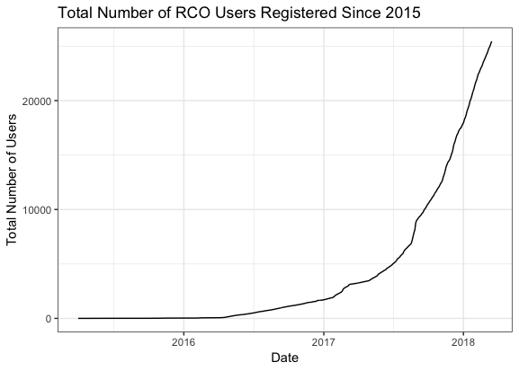
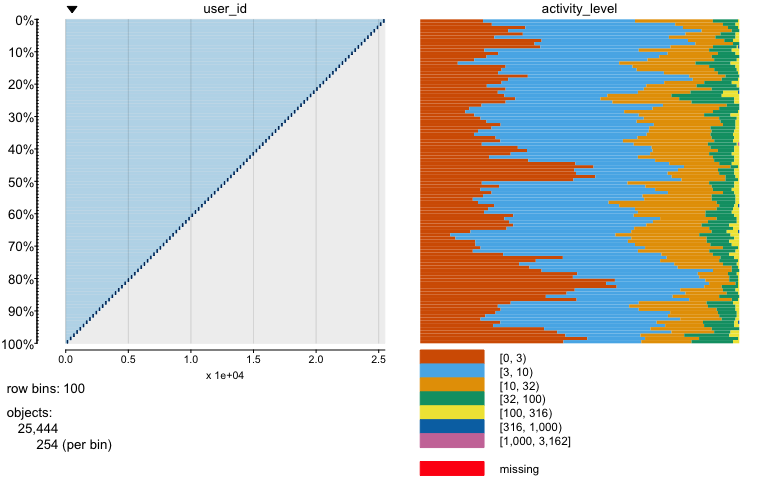
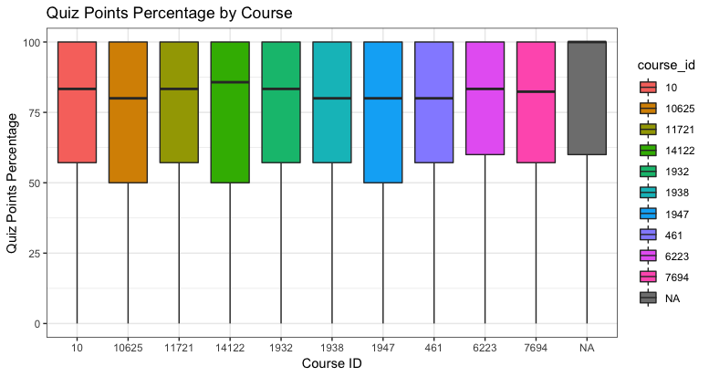
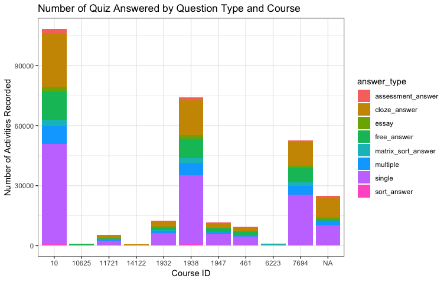
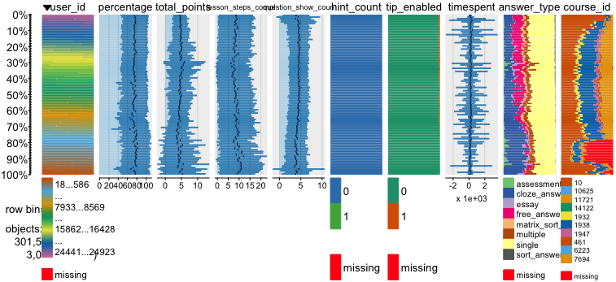
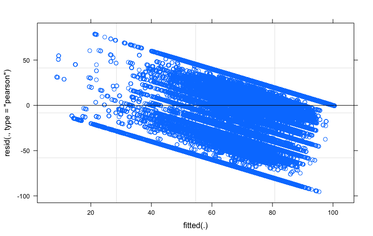
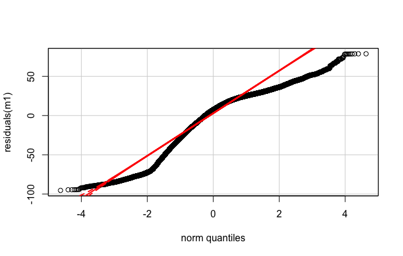

## [the Refugee Center Online](https://therefugeecenter.org/about-us/)

- The Refugee Center Online (RCO) uses technology to help refugees and displaced individuals build new lives in the United States. 
- This analysis only looked at users (online students) who have participated in GED and Citizenship courses on RCO from 2015-03-31 to 2018-03-16.
- The data set were collected from its web server.

## RCO: Fact 1
- There are about 26,000 users registered in total at therefugeecenter.org from 2015-03-31 to 2018-03-16.



## RCO: Fact 2
- About 50% of RCO users conducted less than 10 activities for last three years.


## RCO: Fact 3
- Almost 297,000 activities in total for 10 known courses and some unknown course(s) were conducted by 19,000 RCO students, and about 1,700 quiz questions were answered.


## RCO: Fact 3
- Over half of quiz questions for the 10 courses are single choice type question.


## Current Model

**Generalized Linear Mixed-Effects Model**

  + Response: *quiz_percentage* (points earned out of total points for each quiz)
  + Fixed effects: 
    - __*total_points*__: equivalent to number of questions in each quiz since every quiz question have one point.
    - __*lesson_steps_completed*__: number of lesson steps completed before taking the quiz.
    - __*hint_count*__: whether there is an hint or not for the quiz question.
    - __*tip_enabled*__: whether the RCO students used the hint or not when taking the quiz.
    - __*timespent*__: total seconds spending on taking the quiz.
    - __*answer_type*__: quiz question type
    - __*course_id*__: categorical, represent different courses

  + Random effects:
    - *user_id*: ID for RCO students.
    
```{r, message = FALSE, warning = FALSE, eval = FALSE, echo = TRUE, include = TRUE}
model <- glmer(percentage ~ total_points + answer_type + 
                 lesson_steps_completed + question_show_count + timespent + 
                 tip_enabled + course_id + (1|user_id),
            data = test_df, family = gaussian) 
```

## Data for this mixed-effects model




## Issues with Current Model
  + There seems a decreasing trend as fitted value getting larger in the distribution of residuals.



## Move on: Further data mining
  + Identify and remove spam users and tested questions 
    - check number of quiz they took
    - Check time they spent on RCO website
  + Find patterns of successful RCO students' behavior (in *toplist* table)
  + Try to figure out why some RCO students' activity data are missing 

## Improve data modeling
  + Include text data in the model
    - lesson content
    - question content
    - hint message
    - other
  + Test if other data should be included
    - editor
    - number of hints
    - RCO students' gender, hometown, having kids or not
    - RCO students' language
    - other
  + Test correlations among variables
  + Run cross validation 

----

